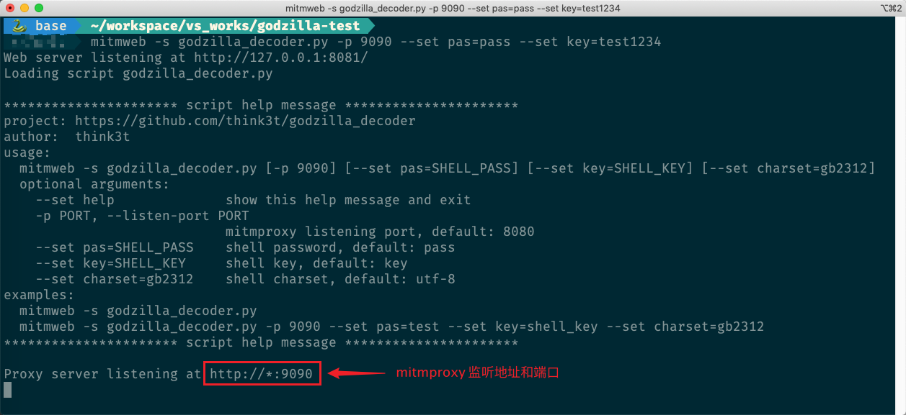
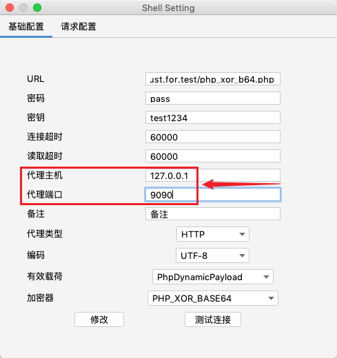
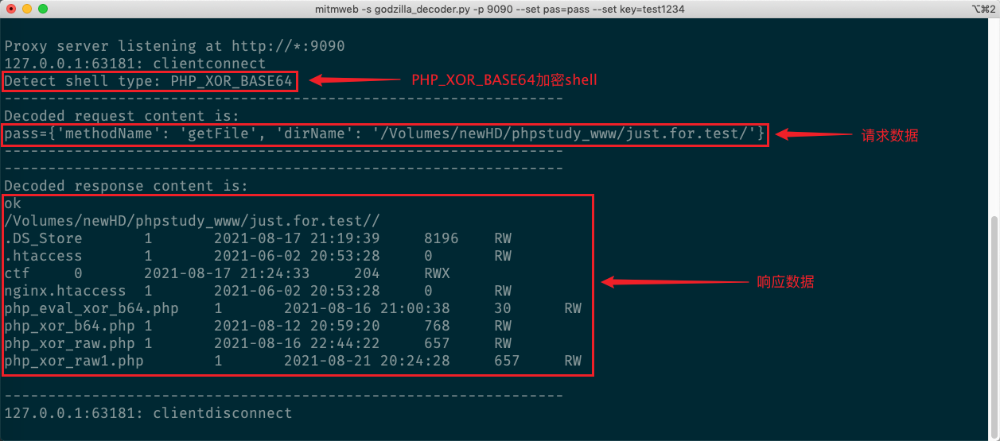
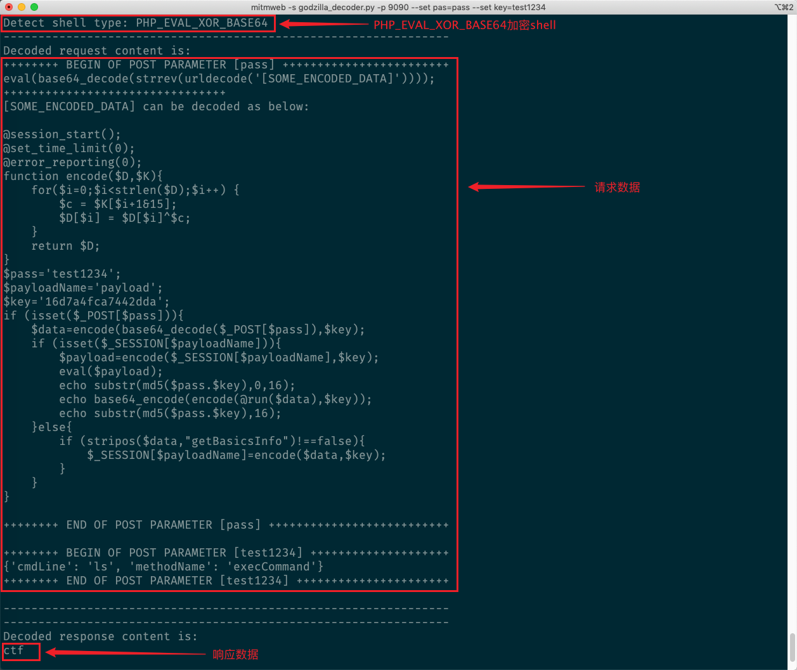
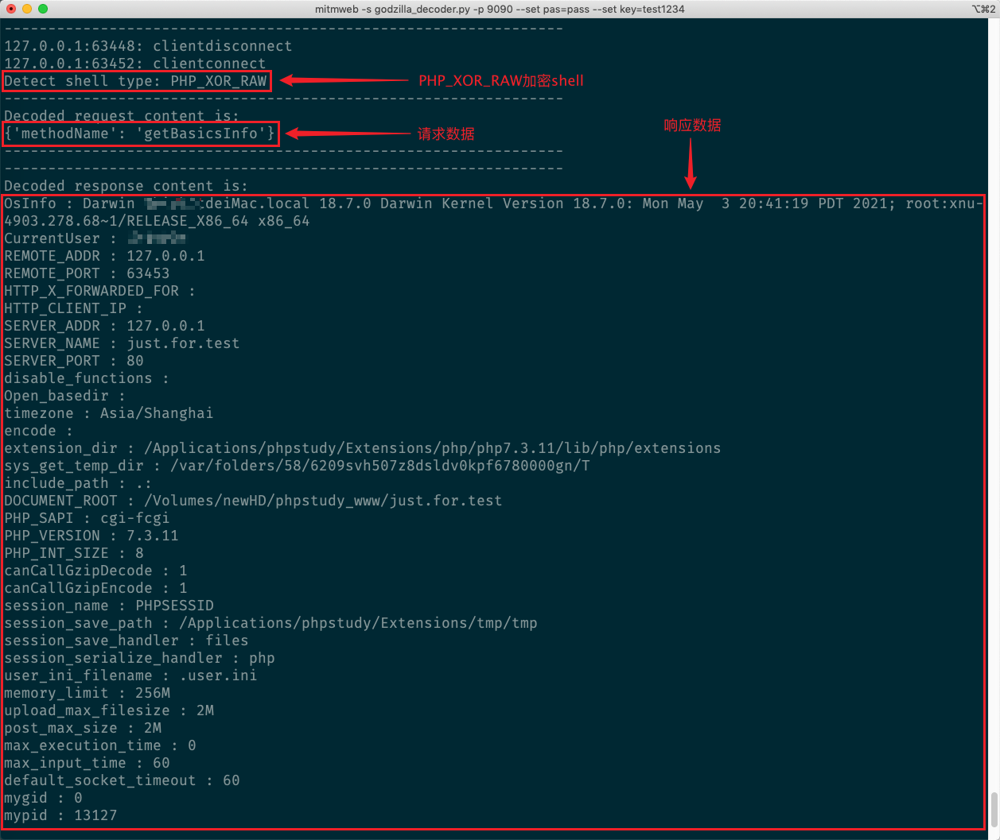

# Godzilla Decoder


## 简介

**Godzilla Decoder** 是一个用于 **[哥斯拉Godzilla](https://github.com/BeichenDream/Godzilla)** 加密流量分析的辅助脚本。

**Godzilla Decoder** 基于 **[mitmproxy](https://mitmproxy.org/)**，是`mitmproxy`的`addon`脚本。

目前支持 **[哥斯拉3.0.3](https://github.com/BeichenDream/Godzilla/releases/tag/v3.03-godzilla)** `PhpDynamicPayload`的三种加密器：

+ `PHP_XOR_BASE64`
+ `PHP_EVAL_XOR_BASE64`
+ `PHP_EVAL_RAW`


## 运行环境

+ python 3.7 及以上
+ mitmproxy 5.1.1 及以上


## 用法

1. 首先，启动`mitmweb`并加载`godzilla_decoder.py`脚本

```shell
usage:
  mitmweb -s godzilla_decoder.py [-p 9090] [--set pas=SHELL_PASS] [--set key=SHELL_KEY] [--set charset=gb2312]
  optional arguments:
    --set help              show this help message and exit
    -p PORT, --listen-port PORT
                            mitmproxy listening port, default: 8080
    --set pas=SHELL_PASS    shell password, default: pass
    --set key=SHELL_KEY     shell key, default: key
    --set charset=gb2312    shell charset, default: utf-8
examples:
  mitmweb -s godzilla_decoder.py
  mitmweb -s godzilla_decoder.py -p 9090 --set pas=test --set key=shell_key --set charset=gb2312
```



2. 哥斯拉中设置shell代理为`mitmproxy`服务器监听地址和端口



3. 操作哥斯拉过程中，控制台实时输出解密后的请求数据和响应数据






